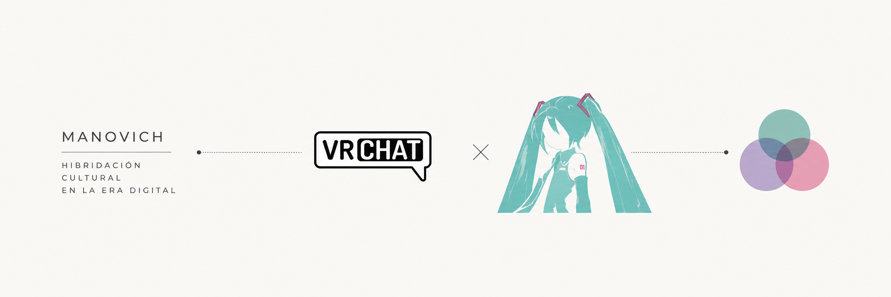
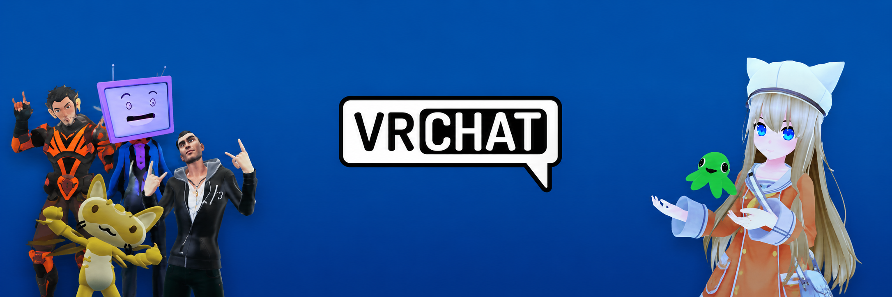

# PEC3: Visionando el futuro con las gafas de Manovich

### Recurso de aprendizaje de Cultura Digital

**Autor:** Pablo Carvalho Ramos  
**Centro:** Universitat Oberta de Catalunya (UOC)  
**Fecha:** Mayo de 2026  

---

## Índice

1. [Introducción](#introducción)
2. [Re-descubriendo la hibridación: VRChat](#re-descubriendo-la-hibridación-vrchat)
3. [Re-descubriendo la hibridación: Hatsune Miku](#re-descubriendo-la-hibridación-hatsune-miku)
4. [Conclusión](#conclusión)
5. [Referencias y Bibliografía](#referencias-y-bibliografía)
6. [Licencia](#licencia)

---

# Introducción

Lev Manovich lleva años argumentando que el ordenador no es solo una herramienta, sino un metamedio capaz de absorber y transformar todos los medios anteriores. En *El software toma el mando* desarrolla la idea de hibridación: el proceso por el que distintos medios no simplemente coexisten en pantalla, sino que se fusionan a nivel estructural hasta generar algo nuevo. No es lo mismo que multimedia, donde los medios se presentan juntos pero siguen siendo reconocibles por separado.

La distinción importa. Como explica el propio Manovich:

> "Un híbrido puede definir nuevas técnicas de navegación e interacción que funcionan con formatos de medios no modificados. Por otro lado, un híbrido puede definir nuevos formatos de medios, pero utilizar técnicas de interacción/interfaces ya existentes."  
> — Lev Manovich, *El software toma el mando*

A esto añade el concepto de *deep remixability* o remixabilidad profunda: no se trata solo de combinar contenidos de medios distintos, sino de mezclar sus técnicas, estructuras y lógicas internas para crear algo cualitativamente diferente (Manovich, 2007). Esta idea es el hilo conductor de los dos casos que analizo aquí.

He escogido VRChat y Hatsune Miku porque los dos me parecen ejemplos muy claros de hibridación en el sentido que Manovich describe, y también porque son fenómenos que conocía de antes y sobre los que tenía curiosidad de reflexionar con esta perspectiva. Ninguno de los dos encaja en las categorías habituales, y eso es precisamente lo interesante.

---

# Re-descubriendo la hibridación: VRChat

Cuando se habla de realidad virtual, la primera imagen que viene a la cabeza suele ser la de alguien con unas gafas jugando a un videojuego. Pero VRChat es otra cosa. Lanzada en 2017, es una plataforma donde la gente se reúne mediante avatares personalizados en mundos tridimensionales creados por la propia comunidad. Y lo que la hace interesante para este ensayo es que, vista con las gafas de Manovich, encaja perfectamente en la idea de hibridación: no es un videojuego, ni una red social, ni una herramienta de streaming, pero tiene algo de todo eso a la vez y lo mezcla de una forma que genera algo nuevo.

En *El software toma el mando*, Manovich explica que la hibridación no consiste en poner medios distintos uno al lado del otro, sino en fusionarlos hasta que "las interfaces, técnicas y presuposiciones más básicas de diversos medios se unen y dan pie a nuevas gestalts de medios". Eso es exactamente lo que pasa en VRChat. El usuario no navega con ventanas ni menús: se mueve corporalmente por un espacio, habla con su propia voz, gesticula con su cuerpo. La interfaz deja de ser algo externo y se convierte en un entorno habitable. Esto genera nuevas posibilidades para que las personas representen su yo esencial, con formas de autoexpresión que no serían posibles en el mundo físico.

El tema de la identidad es quizás lo que más me llama la atención de VRChat. En plataformas como Instagram o Discord seguimos siendo, en el fondo, una foto y un nombre. En VRChat, el avatar es otra cosa: una extensión performativa del usuario. La gente puede ir con un personaje anime, una criatura fantástica o un robot, y usar eso para construir una identidad digital que no tiene por qué coincidir con la física. Estudios recientes muestran que el sistema de rastreo corporal completo (*full-body tracking*), combinado con el anonimato de la plataforma, permite expresar emociones y adoptar personalidades completamente distintas a las de la vida real, generando un intercambio más abierto y diverso (Frontiers in Virtual Reality, 2024). La hibridación aquí no es solo tecnológica: es social.

Este aspecto se ve muy bien en el fenómeno de los VTubers, que usan VRChat para hacer directos en Twitch o YouTube con avatares y captura de movimiento. Aquí se apila una nueva capa de hibridación: streaming, performance digital, cultura anime y realidad virtual se mezclan en una misma experiencia mediática. No es casualidad que solo una muestra de 300 creadores virtuales generara más de 15.000 millones de visualizaciones en YouTube durante 2024 (Telangana Today, 2025). Es el tipo de dato que ilustra bien lo que Manovich llamaría el surgimiento de una nueva especie de medio.

La dimensión de la comunidad es clave. Los usuarios no solo consumen VRChat: diseñan mundos, avatares y objetos usando herramientas como Unity. La plataforma funciona como un ecosistema en constante expansión donde los usuarios son también creadores (Frontiers in Virtual Reality, 2024). Esto conecta con el concepto de *remixabilidad profunda* de Manovich: no se remezclan solo contenidos, sino las lógicas y técnicas de medios distintos. Un buen ejemplo es el festival SANRIO en VRChat, donde la empresa trasladó su parque temático físico Sanrio Puroland al entorno virtual, incluyendo cantantes virtuales y VTubers (VIVE Blog, 2024). Lo físico y lo digital se mezclan de una forma que ninguno de los dos medios por separado haría posible.

VRChat es, en definitiva, una de esas plataformas que hace que las categorías habituales se queden cortas. No encaja en ninguna caja: no es un juego, no es una red social, no es un espacio de entretenimiento convencional. Es las tres cosas a la vez y, al serlo, se convierte en algo diferente. Eso es exactamente lo que Manovich tenía en mente cuando hablaba de las nuevas especies de medio que el software hace posibles.

### Tráiler oficial de VRChat

# Re-descubriendo la hibridación: Hatsune Miku

Cuando alguien escucha hablar de Hatsune Miku por primera vez, tiende a clasificarla rápido: "La cantante virtual japonesa". Pero reducirla a eso es perderse lo más interesante. Desde la perspectiva de Manovich, Hatsune Miku es un caso extraordinario de hibridación donde música, software, animación digital y cultura participativa se fusionan en algo que no encaja en ninguna categoría anterior.

Miku apareció en 2007 como parte del software Vocaloid, desarrollado por Yamaha y distribuido por Crypton Future Media. Técnicamente, era un sintetizador de voz: el usuario escribía una melodía y una letra, y el programa las convertía en una interpretación vocal usando fragmentos pregrabados por la actriz de doblaje Saki Fujita. Su nombre, Hatsune Miku (初音ミク), significa "el primer sonido del futuro", y ese nombre resultó más que acertado (Root-Nation, 2025). Porque lo que empezó como una herramienta de producción musical acabó convirtiéndose en un fenómeno cultural que cruza fronteras entre la música, el anime, los videojuegos y el espectáculo en directo.

Aquí es donde entra Manovich. La hibridación, para él, no ocurre cuando pones distintos medios uno al lado del otro, sino cuando sus técnicas y lógicas se fusionan hasta crear algo nuevo. Hatsune Miku no es música más una imagen de anime más un software: es un personaje cuya existencia depende de que todos esos elementos funcionen juntos. Desde su nacimiento, atrajo tanto a músicos amateurs como a fans del anime, formando una comunidad que encontró en ella un punto de encuentro para múltiples culturas mediáticas (Ethnomusicology Review, 2017). Eso es exactamente la gestalt de medios de la que habla Manovich: el todo que no puede descomponerse en partes sin dejar de ser lo que es.

Uno de los aspectos que más me parece reseñable es lo que hace con la idea de artista musical. Desde siempre, la industria de la música se ha construido sobre la figura de una persona real que actúa en directo. Miku invierte eso por completo: su voz es sintética, su cuerpo es una animación 3D y sus conciertos son proyecciones sincronizadas con música en vivo. En 2024 actuó en Coachella, uno de los festivales más grandes del mundo, proyectada sobre una pantalla gigante ante miles de personas (The-O Network, 2024). Una entidad puramente digital ocupando el mismo espacio que los artistas físicos. Lo que Manovich llama un nuevo formato de representación en estado puro: Miku no imita a una cantante humana, propone una forma de presencia artística que solo existe gracias al software.

### Concierto holográfico de Hatsune Miku

El otro gran pilar es la participación de la comunidad. Crypton posicionó a Miku desde el principio como una plataforma abierta, no como una franquicia cerrada. Eso lo cambió todo. Miles de usuarios empezaron a crear canciones, ilustraciones, animaciones y coreografías, compartidas en plataformas como Nico Nico Douga y YouTube. En los primeros años ya circulaban más de 100.000 canciones creadas por fans (Root-Nation, 2025). Los investigadores describen el resultado como "una ecología en evolución de técnicos de software, productores y miembros del público que colaboran para hacer música Vocaloid" (NHSJS, 2024). Los usuarios no son consumidores: son coautores de un personaje que se reescribe constantemente. Es la lógica del software colaborativo aplicada a la cultura popular, algo muy cercano a lo que Manovich describe cuando habla del software como motor de la creación colectiva.

Lo que más me llama la atención de Hatsune Miku, mirándolo desde fuera, es que su existencia anticipa muchas de las discusiones que hoy tenemos sobre creatividad e inteligencia artificial. Mucho antes de que "arte generado por IA" se pusiera de moda, Miku ya mostraba que la colaboración entre humanos y software podía producir cultura a gran escala (Root-Nation, 2025). Y todo ello con una comunidad que la sostiene, la reinventa y la mantiene viva. Eso, para Manovich, sería la prueba definitiva: una nueva especie de medio que no existía antes del software y que no puede entenderse sin él.

---

# Conclusión

VRChat y Hatsune Miku son dos formas muy distintas de llegar al mismo sitio: la hibridación mediática en el sentido que describe Manovich. Los dos fusionan técnicas, interfaces y lógicas de medios distintos para crear algo que no puede descomponerse en partes sin perder su esencia.

VRChat redefine la interacción social y la identidad digital en entornos virtuales. Hatsune Miku redefine la autoría musical y la presencia artística. En ninguno de los dos casos estamos hablando de multimedia: estamos hablando de medios que se transforman mutuamente gracias al software hasta producir algo nuevo.

Lo que me parece más valioso de estos dos ejemplos es que, en los dos, la comunidad de usuarios no es algo secundario: es el motor. Tanto VRChat como Hatsune Miku existen y evolucionan porque hay gente que los construye, los reinventa y los mantiene vivos. 

---

# Referencias y Bibliografía

## Bibliografía principal

- Manovich, Lev. (2013). *El Software toma el mando*. Barcelona: Editorial UOC.
- Manovich, Lev. (2007). *Understanding Hybrid Media*. Publicado en Betti-Sue Hertz (ed.), *Animated Paintings*. San Diego: San Diego Museum of Art. Disponible en: http://manovich.net/content/04-projects/055-understanding-hybrid-media/52_article_2007.pdf
- Gea, M. (2022). *Herramientas y metodología crowdsourcing para la participación y creación colectiva de conocimiento abierto*. Barcelona: Editorial UOC.

## Artículos y estudios académicos

- Frontiers in Virtual Reality. (2022). *Digital body, identity and privacy in social virtual reality: A systematic review*. Disponible en: https://www.frontiersin.org/journals/virtual-reality/articles/10.3389/frvir.2022.974652/full
- Frontiers in Virtual Reality. (2024). *Gender expression and gender identity in virtual reality: avatars, role-adoption, and social interaction in VRChat*. Disponible en: https://www.frontiersin.org/journals/virtual-reality/articles/10.3389/frvir.2024.1305758/full
- NHSJS (National High School Journal of Science). (2024). *The Vocaloid Phenomenon: Deconstruction of Music Culture Through Hatsune Miku*. Disponible en: https://nhsjs.com/2024/the-vocaloid-phenomenon-deconstruction-of-music-culture-through-hatsune-miku/
- Ethnomusicology Review, UCLA. (2017). *Thoughts on Convergence and Divergence in Vocaloid Culture (and Beyond)*. Disponible en: https://ethnomusicologyreview.ucla.edu/content/thoughts-convergence-and-divergence-vocaloid-culture-and-beyond
- Universidad de Sevilla (IDUS). (2023). *Hatsune Miku y fenómeno Vocaloid: factores socioculturales del auge de los ídolos virtuales*. Disponible en: https://idus.us.es/server/api/core/bitstreams/42e0460f-1733-4465-a928-da117bc98b28/content

## Fuentes de referencia digital

- Root-Nation.com. (2025). *Vocaloids e IA: Cómo Hatsune Miku redefinió la industria musical*. Disponible en: https://es.root-nation.com/en/articles-en/tech-en/en-vocaloids-and-ai-hatsune-miku/
- The-O Network. (2024). *YOASOBI and Hatsune Miku at Coachella 2024 Report*. Disponible en: https://www.t-ono.net/concerts/yoasobi-and-hatsune-miku-at-coachella-2024-report.html
- Telangana Today. (2025). *Who are 'VTubers' taking content creation space by storm? YouTube's 'Culture & Trends Report – 2024' explains*. Disponible en: https://telanganatoday.com/who-are-vtubers-taking-content-creation-space-by-storm-youtubes-culture-trends-report-2024-explains
- VIVE Blog. (2024). *SANRIO Fest [2024]: VRChat, VTubers, and Collectibles!* Disponible en: https://blog.vive.com/us/sanrio-virtual-festival-2024-a-new-dimension-of-fun-in-vrchat-vtubers-lineup-and-collaborative-collectibles/
- Manovich, Lev. (2006). *Deep Remixability*. Remix Theory. Disponible en: http://remixtheory.net/?p=61

## Webgrafía de las plataformas

- https://hello.vrchat.com/
- https://docs.vrchat.com/
- https://ec.crypton.co.jp/pages/prod/virtualsinger
- https://vocaloid.fandom.com/wiki/Hatsune_Miku

---

## Declaración sobre el uso de IA

Para la realización de esta PEC se han utilizado herramientas de inteligencia artificial como apoyo puntual durante el proceso de elaboración siguiendo la normativa de la asignatura.

Se ha utilizado ChatGPT para la generación de la imagen de cabecera del ensayo y Claude como apoyo en la corrección y mejora de la redacción en Markdown, así como en la organización y gestión de las fuentes y referencias utilizadas.

La selección de los casos analizados, el enfoque del análisis, la interpretación de los conceptos de hibridación de Lev Manovich y los contenidos principales del ensayo —incluyendo introducción, desarrollo y conclusiones— son de autoría propia.

## Licencia

Este repositorio y su contenido han sido desarrollados bajo la licencia Creative Commons Attribution-ShareAlike 4.0 (CC BY-SA 4.0). Se permite compartir, copiar, redistribuir y adaptar el material, siempre que se reconozca adecuadamente la autoría original y las obras derivadas se distribuyan bajo la misma licencia.

Las imágenes, recursos audiovisuales y marcas mencionadas en este ensayo pertenecen a sus respectivos propietarios y han sido utilizadas únicamente con fines educativos y académicos dentro del contexto de esta práctica universitaria.

